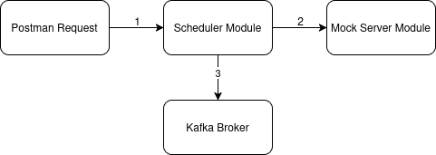

# sportygr

Components used:
- kafka version: (latest image available)
- java version: openjdk version "17.0.15" 2025-04-15
- spring boot version: 3.5.0
- docker desktop version: v4.41.2
- kubuntu version: 25.04

Multimodule gradle application, with 2 Java modules.

1. The mockserver, very simple spring boot app, with just one endpoint,
It contains the same response for any event (just use the eventId you send).
This works as an "update server", so you send the eventId you want to know updates for.
and get an answer with the current score, and if the event is still live.

Method: GET
url: localhost:8081/api/events/{eventId}
Output: 
```json
   {
   "eventId": "123456",
   "live": true,
   "currentScore": "0:0"
   }
```

2. The scheduler, the most important component here, also has one endpoint to register
If you want to get updates, the app is going to create a task and request updates
from the mockserver every 10 seconds (from the endpoint above), only if the event is "live"

Method: POST
url: localhost:8080/api/events/status
Input:
```json
{
"eventId": "123456",
"live": false
}
```

Also, related to Kafka, we have 2 other components:
The Kafka broker, and the kafka-ui where you can check topics and messages, the URL is:
http://localhost:8088/

All were dockerized and are able to start using Docker Compose, just execute from the project directory:
docker-compose up -d

And if you want to check the logs of the two components:
docker logs -f scheduler
docker logs -f mockserver

Also, there is a graphic with the interaction of those components: 


1. First, the scheduler that is going to receive a request from Postman or curl, and if the event is live
is going to schedule a call for an API every ten seconds.

2. The next component is the mock server, it is very simple and just has an endpoint that receives an eventId
and answers with a hardcoded result for any event

3. The last one, the Kafka broker, the response from the mockserver is sent to the Kafka broker for the topic used.

There is a postman collection included in the postman directory, you can use to test the apps.

Decisions
- Quartz over task scheduler (native scheduler doesn't support params, the eventId)
- No AI
- Docker compose was better to build a one component with all the apps, instead of k8s
- REST very simple endpoints.
- Lombok over records, because of familiarity, basically
- Log4j, for very simple logging

Missing:
- Basic error handling, basically the idea was to use a retryable topic, and also create custom exceptions.
- Missing to improve HTTP codes, and validations around the input DTO using validators.
- Parameterized the time for the scheduled and other values.
- Tests for sure.
- OpenAPI for API documentation.
- Much stuff on the way, will be improved in the next iteration if it's required.
